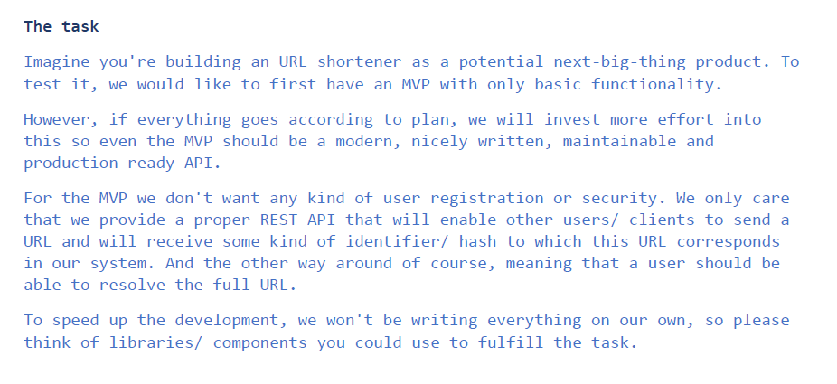
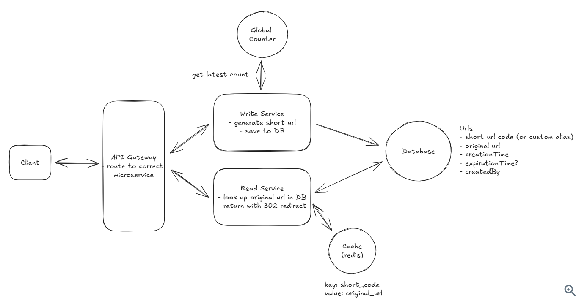

# DKB CodeFactory - URL Shortener
### Project Description: 
This is URL shortening project that creates and resolves short URLs with Redis caching. It converts long URLs into shorter, manageable links. 
Built with: Kotlin, Spring Boot, PostgreSQL, Redis(global counter + caching), OpenAPI, Testing(JUnit, Mockito)

### Task Description:

### High_Level_Architecture Diagram 
 

# Table of Contents
- Features
- Design Decisions and the Rationale behind them/ Core Concepts
- Basic APIs
- Data Flow

# I) Features
## Functional:
1) Users should be able to submit a long URL and receive a shortened version.
2) Users should be able to access the original URL by using the shortened URL.

Since this is an MVP, as per the task description the features are kept simple and minimalistic, but as an extension other features like, optionally, users should be able to specify a custom alias for their shortened URL. Optionally, users should be able to specify an expiration date for their shortened URL, user authentication and account management, analytics on link clicks, etc. These are also commonly found but currently considered "below the line" because they add complexity to the system without being core to the basic functionality of a URL shortener. 

## Non Functional:
1) The system should ensure uniqueness for the short codes (no two long URLs can map to the same short URL)
2) The redirection should occur with minimal delay
3) The system should be reliable, available and scalable.

# II) Design Decisions and the Rationale behind them/ Core Concepts

## 1) Generate unique short url (as short as possible) - ensure its uniqueness in a distributed environment, reduce the likelihood of collision, support scalability, and improve performance

•	One way to guarantee we don't have collisions is to simply increment a counter for each new url. We can then take the output of the counter and encode it using base62 encoding to ensure it's a compacted representation.

•	Redis is particularly well-suited for managing this counter because it's single-threaded and supports atomic operations. Being single-threaded means Redis processes one command at a time, eliminating race conditions. Its INCR command is atomic, meaning the increment operation is guaranteed to execute completely without interference from other operations. This is crucial for our counter - we need absolute certainty that each URL gets a unique number, with no duplicates or gaps.

•	Each counter value is unique, eliminating the risk of collisions without the need for additional checks. Incrementing a counter and encoding it is computationally efficient, supporting high throughput. With proper counter management, the system can scale horizontally to handle massive numbers of URLs. The short code can be easily decoded back to the original ID if needed, aiding in database lookups.

### Is there any additional optimization that can be done for the Redis counter? 

• "counter batching" to reduce the number of network requests. 
In a microservices architecture, each Write Service instance requests a batch of counter values from the Redis instance (e.g., 1000 values at a time). 
The Redis instance atomically increments the counter by 1000 and returns the start of the batch.

• The Write Service instance can then use these 1000 values locally without needing to contact Redis for each new URL. 
When the batch is exhausted, the Write Service requests a new batch.
This approach reduces the load on Redis while still maintaining uniqueness across all instances. It also improves performance by reducing network calls for counter values.

• To ensure high availability of our counter service, we can use Redis's built-in replication features. Redis Enterprise, for example, provides automatic failover and cross-region replication. For additional durability, we can periodically persist the counter value to a more durable storage system.

## 2) Type of Redirect:
There are two main types of HTTP redirects that we could use for this purpose:

• 301 (Permanent Redirect): This indicates that the resource has been permanently moved to the target URL. Browsers typically cache this response, meaning subsequent requests for the same short URL might go directly to the long URL, bypassing our server.

• 302 (Temporary Redirect): This suggests that the resource is temporarily located at a different URL. Browsers do not cache this response, ensuring that future requests for the short URL will always go through our server first.

• In either case, the user's browser (the client) will automatically follow the redirect to the original long URL and users will never even know that a redirect happened.

• For a URL shortener, a 302 redirect is often preferred because:
It gives us more control over the redirection process, allowing us to update or expire links as needed.
It prevents browsers from caching the redirect, which could cause issues if we need to change or delete the short URL in the future. It allows us to track click statistics for each short URL (even though this is out of scope for this design).

## 3) Low latency responses

•To improve redirect speed, we can introduce an in-memory cache like Redis (used in this project) or Memcached between the application server and the database. This cache stores the frequently accessed mappings of short codes to long URLs. When a redirect request comes in, the server first checks the cache. If the short code is found in the cache (a cache hit), the server retrieves the long URL from the cache, significantly reducing latency. If not found (a cache miss), the server queries the database, retrieves the long URL, and then stores it in the cache for future requests.

•The key here is that instead of going to disk we access the mapping directly from memory. This difference in access speed is significant:
Memory access time: ~100 nanoseconds (0.0001 ms)
SSD access time: ~0.1 milliseconds
HDD access time: ~10 milliseconds
This means memory access is about 1,000 times faster than SSD and 100,000 times faster than HDD. In terms of operations per second:
Memory: Can support millions of reads per second
SSD: ~100,000 IOPS (Input/Output Operations Per Second)
HDD: ~100-200 IOPS

But Redis is an in-memory storage! 

• You can set up replication. The replicas will hold a copy of a master data and will serve as a failover. So if the master instance fails, the replicas remain.

• You can set up Redis persistence. In this way, the data can be stored on disk as snapshots, or as a log files that can be replayed. For the docker containers, it is possible to mount a shared volume to use as persistent storage. Few tradeoffs that can be considered here inclue cache invalidation can be complex, cache needs time to "warm up," meaning initial requests may still hit the database until the cache is populated. Introducing a cache adds complexity to the system architecture, but it's sub milli-second low latency responses are worth it.

## 4) Entity - URL Entity 
Table contents {shortUrl, originalUrl, created_At}

shortUrl (primary key) and originalUrl is secondary primary key for faster lookups as low latency responses are required for our system. 

### Design decision: 
using shortUrl as the primary key and a unique secondary key/index on originalUrl, omitting an auto-generated surrogate id.

### Rationale: 
• shortUrl is the natural lookup key for the system’s primary access pattern (resolve short → original). Making it the primary key enables direct, index-based lookups without indirection; adding a unique index on originalUrl allows efficient reverse-lookup (original → short). 

• This eliminates an extra column and additional index maintenance for a surrogate id, and reduces storage and I/O, collectively improving read latency and resource usage for the high-throughput, low-latency access model required by the service. If future requirements demand surrogate-based relationships or richer joins, a surrogate id can be introduced later with minimal migration cost.

## 5) Scalabitlity
• We offloaded the heavy read throughput to a cache and write throughput is pretty low. We could estimate that maybe 100k new urls are created per day. 100k new rows per day is ~1 row per second. So any reasonable database technology should do (ie. Postgres, MySQL, DynamoDB, etc). Here Postgres is used.

What if the DB goes down?

• Database Replication: By using a database like Postgres that supports replication, we can create multiple identical copies of our database on different servers. If one server goes down, we can redirect to another. This adds complexity to our system design as we now need to ensure that our Primary Server can interact with any replica without any issues. This can be tricky to get right and adds operational overhead.

• Database Backup: We could also implement a backup system that periodically takes a snapshot of our database and stores it in a separate location. This adds complexity to our system design as we now need to ensure that our Primary Server can interact with the backup without any issues. This can be tricky to get right and adds operational overhead.

# III) Basic APIs

### // Shorten a URL
• It implements idempotent creation: if the long URL already has a short URL, return it; otherwise create one and return the new short URL.
• Tries to find an existing UrlEntity by originalUrl using the repository. Note that the originalUrl is made a secondary pk for faster lookups.
• If found, takes its short code, prefixes it with baseUrl, and returns that full short URL string.
• If not found, it:
generates a new unique key from redisService.uniqueKey() and builds it's corresponding short code,
creates & saves a new UrlEntity with the short code and it's original url, 
and returns full short URL string = baseUrl + saved short code.

POST /short
{
  "originalUrl": "https://www.example.com/some/very/long/url"
}
->
{
  "shortUrl": "http://short.ly/abc123"
}

### // Redirect to Original URL
GET /{shortUrl}
-> HTTP 302 Redirect to the original long URL

### // Resolve the short url
GET /resolve/{shortUrl}
->
{
  "originalUrl": "https://www.example.com/some/very/long/url"
}

# IV) Data Flow
## Shorten a URL
When a user submits a long url, the client sends a POST request to /urls with the long url. Then:
Our system receives the request and validates the long URL (simple check). 
We check if it doesn't already exist in our system (we don't want collisions). 
We can query our database to see if the long URL is already present. 
If the URL is valid and doesn't already exist, we can proceed to generate a short URL.

Redis Counter + Base 32 encoding => unique short code

Once we have the short URL, we can proceed to insert it into our database. Finally, we can return the short URL to the client.

## Getting the corresponding original url
When a user accesses a shortened URL, the following process occurs:
The user's browser sends a GET request to our server with the short code (e.g., GET /abc123).
Our Primary Server receives this request, the server first checks the cache. 
If the short code is found in the cache (a cache hit), the server retrieves the long URL from the cache, significantly reducing latency. 
If not found (a cache miss), the server queries the database, retrieves the long URL, and then stores it in the cache for future requests.

